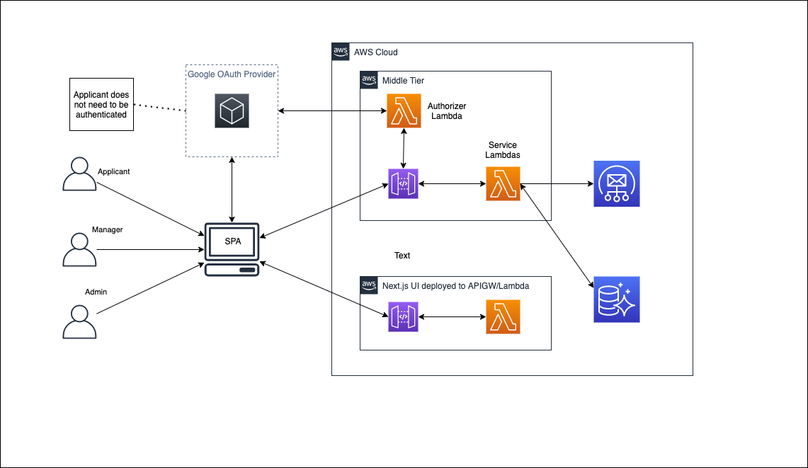
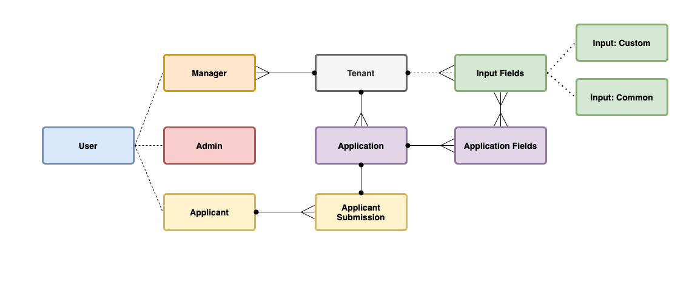

# System Architecture

## Infrastructure Design

## Domain Objects

## [Data Access Patterns](#data-access-patterns)

- Given a userId, get a user
- Given a userId. get all tenants
- Given a tenantId, get a tenant
- Given a tenantId, get all input fields
- Given a tenantId, get all applications
- Given an applicationid, get all application fields
- Given an applicationid, get all applicant submissions
